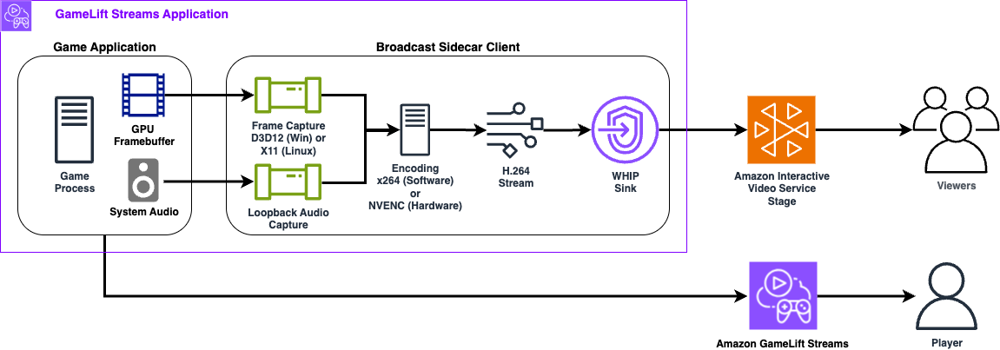

# GameLift Streams IVS Broadcast Sidecar Client (Sample)

A cross-platform sidecar application that captures screen content and system audio using GStreamer and streams it to Amazon IVS (Interactive Video Service). Designed to run alongside game applications on Amazon GameLift Streams instances to enable low-latency multi-viewing of the game session.

> **Note:** This is a sample application intended for demonstration and development purposes. It is not production-ready.

For an end to end demo, please check out this sample React web application that works with sidecar client and includes runtime configuration in the UI:  [Amazon GameLift Streams Multiview with Amazon IVS React Starter Sample](https://github.com/aws-samples/sample-amazon-gamelift-streams-multiview-amazon-ivs-react-app)

## Features

- **Cross-Platform**: Supports Windows and Linux stream class types
- **Screen Capture**: Hardware-accelerated capture using Direct3D 12 (Windows) or X11 (Linux)
- **Audio Capture**: System audio capture with Opus encoding
- **Video Encoding**: H.264 encoding with CPU (x264) or NVIDIA GPU hardware encoder
- **Automatic Fallback**: GPU encoder automatically falls back to CPU if hardware unavailable
- **Low Latency**: Optimized for real-time streaming with zero-latency tuning
- **WHIP Protocol**: WebRTC-HTTP Ingestion Protocol for reliable streaming
- **Self-Contained**: Portable packages with all dependencies included

### Architecture Diagram


## Building

<details>
<summary><strong>Windows</strong></summary>

### Prerequisites

- Visual Studio 2022 (Community, Professional, or Enterprise)
- GStreamer 1.0 development libraries (MSVC x64 build)
- CMake 3.20 or later
- pkg-config

### Install GStreamer

1. Download GStreamer MSVC runtime and development installers from [gstreamer.freedesktop.org](https://gstreamer.freedesktop.org/download/)
2. Install both runtime and development packages
3. Add GStreamer to your PATH or set `GSTREAMER_1_0_ROOT_MSVC_X86_64` environment variable

### Build

```cmd
build-windows.bat
```

The executable will be created at `build\gamelift-streams-ivs-broadcast-sidecar-sample.exe`

### Create Distribution Package

```cmd
package-windows.bat
```

Creates `gamelift-streams-ivs-broadcast-sidecar-sample-windows.zip` with all dependencies included.

</details>

<details>
<summary><strong>Linux</strong></summary>

### Prerequisites

- GCC or Clang compiler
- CMake 3.20 or later
- GStreamer 1.0 development packages
- X11 development libraries
- pkg-config

### Install Dependencies (Ubuntu 22.04)

```bash
sudo apt-get update

# Build tools
sudo apt-get install -y cmake

# GStreamer core and development
sudo apt-get install -y \
    libgstreamer1.0-dev \
    libgstreamer-plugins-base1.0-dev

# GStreamer plugins
sudo apt-get install -y \
    gstreamer1.0-plugins-base \
    gstreamer1.0-plugins-good \
    gstreamer1.0-plugins-bad \
    gstreamer1.0-plugins-ugly \
    gstreamer1.0-tools

# X11 libraries for screen capture
sudo apt-get install -y \
    libx11-dev \
    libxext-dev \
    libxfixes-dev \
    libxdamage-dev

# Audio libraries
sudo apt-get install -y \
    gstreamer1.0-pulseaudio \
    gstreamer1.0-alsa

# NVIDIA drivers (optional, for GPU encoding)
sudo apt-get install -y nvidia-driver-535
```

### Build

```bash
chmod +x build-linux.sh
./build-linux.sh
```

The executable will be created at `build-linux/gamelift-streams-ivs-broadcast-sidecar-sample`

### Create Distribution Package

```bash
chmod +x package-linux.sh
./package-linux.sh
```

Creates `gamelift-streams-ivs-broadcast-sidecar-sample-linux.tar.gz` with launcher scripts.

</details>

## Usage with GameLift Streams

This sidecar application runs alongside your game application on Amazon GameLift Streams instances, capturing screen output and system audio to broadcast to Amazon IVS.

### Sidecar Broadcast Client Runtime Configuration

The sidecar can be configured using command-line arguments, environment variables, or a combination of both. Command-line arguments take precedence over environment variables. This configuration can be passed to the GameLift Streams application when [StartStreamSession](https://docs.aws.amazon.com/gameliftstreams/latest/apireference/API_StartStreamSession.html) is called or through the [Program configurations](https://docs.aws.amazon.com/gameliftstreams/latest/developerguide/streaming-process.html#streaming-process-stream-session) fields if you are testing in the AWS GameLift Streams Console.

> **Note:** For maximum supported video resolution, framerate, and bitrate limits for IVS real-time streaming, see the [IVS Real-Time Streaming ingest specifications](https://docs.aws.amazon.com/ivs/latest/RealTimeUserGuide/rt-stream-ingest.html).

| Setting | CLI Argument | Environment Variable | Default |
|---------|--------------|---------------------|--------|
| Auth token (required) | `--auth-token <token>` | `IVS_STAGE_TOKEN` | - |
| WHIP endpoint (required) | `--whip-endpoint <url>` | `IVS_WHIP_ENDPOINT` | - |
| Encoder type | `--encoder <cpu\|gpu>` | `ENCODER_TYPE` | `gpu` |
| Video width | `--width <pixels>` | `VIDEO_WIDTH` | `1280` |
| Video height | `--height <pixels>` | `VIDEO_HEIGHT` | `720` |
| Video framerate | `--framerate <fps>` | `VIDEO_FRAMERATE` | `30` |
| Video bitrate (kbps) | `--video-bitrate <kbps>` | `VIDEO_BITRATE` | `8000` |
| Audio bitrate (bps) | `--audio-bitrate <bps>` | `AUDIO_BITRATE` | `128000` |
| Disable audio | `--no-audio` | `ENABLE_AUDIO=false` | enabled |
| Debug pipeline | `--debug` | `DEBUG_PIPELINE=true` | disabled |
| GStreamer debug level | - | `GST_DEBUG` | `0` |

<details>
<summary><strong>Windows Stream Groups</strong></summary>

### Requirements

- Windows build (`gamelift-streams-ivs-broadcast-sidecar-sample-windows.zip`)
- Direct3D 12 compatible graphics hardware
- GPU encoding available with NVIDIA stream classes

### Testing the Binary Locally

Test the sidecar on a local Windows system or EC2 instance with equivalent hardware to your target GLS stream group.

Using command-line arguments:

```cmd
run_broadcaster.bat --auth-token YOUR_TOKEN --whip-endpoint https://YOUR_ENDPOINT/whip
```

Using environment variables:

```cmd
set IVS_STAGE_TOKEN=your_token
set IVS_WHIP_ENDPOINT=https://your-endpoint/whip
run_broadcaster.bat
```

With GPU encoding:

```cmd
run_broadcaster.bat --encoder gpu --auth-token YOUR_TOKEN --whip-endpoint https://YOUR_ENDPOINT/whip
```

### Creating and Testing the GLS App with Sidecar

1. **Extract the sidecar package**
   ```cmd
   unzip gamelift-streams-ivs-broadcast-sidecar-sample-windows.zip
   ```

2. **Add your game executable and files** to the extracted package folder alongside the sidecar files.

3. **Update the launch script** - Edit `run_broadcaster_background.bat` and replace the `your-game.exe` placeholder with your actual game executable:
   ```bat
   REM Add your game executable below:
   your-game.exe
   ```

4. **Upload to S3** - Upload the entire folder (game + sidecar files) to an S3 bucket.

5. **Create a GLS Application** - In the GameLift Streams console, create an application that:
   - Points to your S3 folder location
   - Uses `run_broadcaster_background.bat` as the launch script

6. **Test in the console** - Launch a stream session and configure the required environment variables:
   - `IVS_STAGE_TOKEN` - Your IVS stage participant token
   - `IVS_WHIP_ENDPOINT` - Your IVS WHIP endpoint URL
   
   Optionally enable application logs to an S3 bucket to help debug launch issues. See [Streaming Process Documentation](https://docs.aws.amazon.com/gameliftstreams/latest/developerguide/streaming-process.html#streaming-process-stream-session) for details.

7. **Try the GLS-IVS Multiviewer** - Once working in the console, test with the GLS-IVS Multiviewer web app: *GitHub link TBD*

### Verify GPU Encoder Availability

```cmd
gst-inspect-1.0.exe nvh264enc
```

### Troubleshooting

**Application Won't Start**

```cmd
verify-dependencies.bat
test-package.bat
```

**Screen Capture Issues**
- Ensure your system supports Direct3D 12
- Update graphics drivers
- Check that no other application is exclusively using the display

**Audio Issues**
- Verify system audio is working
- Check Windows audio settings
- WASAPI loopback requires audio to be actively playing

**Enable Debug Logging**

```cmd
set GST_DEBUG=3
gamelift-streams-ivs-broadcast-sidecar-sample.exe --auth-token TOKEN --whip-endpoint URL
```

</details>

<details>
<summary><strong>Linux Stream Groups</strong></summary>

### Requirements

- Linux build (`gamelift-streams-ivs-broadcast-sidecar-sample-linux.tar.gz`)
- X11 display server (Wayland is not supported)
- PulseAudio or ALSA for audio
- GPU encoding available with NVIDIA stream classes

### Testing the Binary Locally

Test the sidecar on a local Linux system or EC2 instance with equivalent hardware to your target GLS stream group.

Install dependencies first:

```bash
sudo ./scripts/install-dependencies.sh
```

Using command-line arguments:

```bash
./run_broadcaster.sh --auth-token YOUR_TOKEN --whip-endpoint https://YOUR_ENDPOINT/whip
```

Using environment variables:

```bash
export IVS_STAGE_TOKEN=your_token
export IVS_WHIP_ENDPOINT=https://your-endpoint/whip
./run_broadcaster.sh
```

With GPU encoding:

```bash
./run_broadcaster.sh --encoder gpu --auth-token YOUR_TOKEN --whip-endpoint https://YOUR_ENDPOINT/whip
```

### Creating and Testing the GLS App with Sidecar

1. **Extract the sidecar package**
   ```bash
   tar -xzf gamelift-streams-ivs-broadcast-sidecar-sample-linux.tar.gz
   ```

2. **Add your game executable and files** to the extracted package folder alongside the sidecar files.

3. **Update the launch script** - Edit `run_broadcaster_background.sh` and replace the `your-game` placeholder with your actual game executable:
   ```bash
   # Add your game executable below:
   ./your-game
   ```

4. **Upload to S3** - Upload the entire folder (game + sidecar files) to an S3 bucket.

5. **Create a GLS Application** - In the GameLift Streams console, create an application that:
   - Points to your S3 folder location
   - Uses `run_broadcaster_background.sh` as the launch script

6. **Test in the console** - Launch a stream session and configure the required environment variables:
   - `IVS_STAGE_TOKEN` - Your IVS stage participant token
   - `IVS_WHIP_ENDPOINT` - Your IVS WHIP endpoint URL
   
   Optionally enable application logs to an S3 bucket to help debug launch issues. See [Streaming Process Documentation](https://docs.aws.amazon.com/gameliftstreams/latest/developerguide/streaming-process.html#streaming-process-stream-session) for details.

7. **Try the GLS-IVS Multiviewer** - Once working in the console, test with the GLS-IVS Multiviewer web app: *GitHub link TBD*

### Verify GPU Encoder Availability

```bash
nvidia-smi
gst-inspect-1.0 nvenc_h264
```

### Troubleshooting

**Screen Capture Not Working**

Ensure you're running under X11, not Wayland:

```bash
echo $XDG_SESSION_TYPE  # Should show "x11"
```

To force X11 on Ubuntu: Select "Ubuntu on Xorg" at login screen.

**Missing GStreamer Plugins**

```bash
# Check for required plugins
gst-inspect-1.0 ximagesrc
gst-inspect-1.0 x264enc
gst-inspect-1.0 opusenc
gst-inspect-1.0 whipsink

# Install missing plugins
sudo apt-get install gstreamer1.0-plugins-good  # ximagesrc
sudo apt-get install gstreamer1.0-plugins-ugly  # x264enc
sudo apt-get install gstreamer1.0-plugins-base  # opusenc
sudo apt-get install gstreamer1.0-plugins-bad   # whipsink
```

**Audio Issues**

```bash
# Check PulseAudio is running
pulseaudio --check && echo "PulseAudio running"

# List audio sources
pactl list sources short

# Verify autoaudiosrc works
gst-launch-1.0 autoaudiosrc ! fakesink
```

**Enable Debug Logging**

```bash
export GST_DEBUG=3
./gamelift-streams-ivs-broadcast-sidecar-sample --auth-token TOKEN --whip-endpoint URL
```

</details>

## Security

The sample code; software libraries; command line tools; proofs of concept; templates; or other related technology (including any of the foregoing that are provided by our personnel) is provided to you as AWS Content under the AWS Customer Agreement, or the relevant written agreement between you and AWS (whichever applies). You should not use this AWS Content in your production accounts, or on production or other critical data. You are responsible for testing, securing, and optimizing the AWS Content, such as sample code, as appropriate for production grade use based on your specific quality control practices and standards. Deploying AWS Content may incur AWS charges for creating or using AWS chargeable resources, such as running Amazon EC2 instances or using Amazon S3 storage.

See [CONTRIBUTING](CONTRIBUTING.md#security-issue-notifications) for more information.

## License

This library is licensed under the MIT-0 License. See the LICENSE file.
