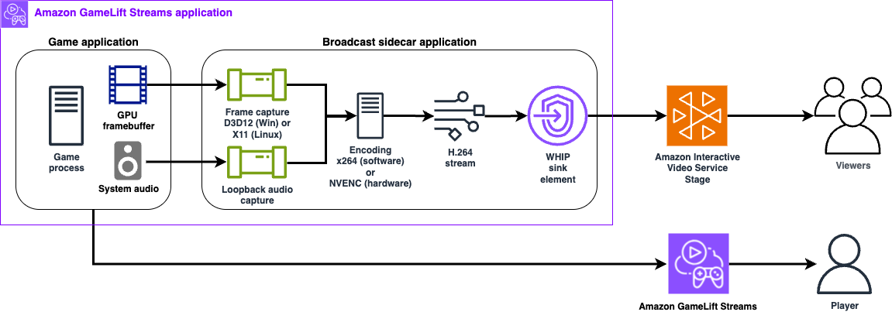

# GameLift Streams IVS Broadcast Sidecar Application (Sample)

A cross-platform sidecar application that captures screen content and system audio using GStreamer and streams it to Amazon IVS (Interactive Video Service). Designed to run alongside game applications on Amazon GameLift Streams instances to enable low-latency multi-viewing of the game session.

> **Note:** This is a sample application intended for demonstration and development purposes. It is not production-ready.

For an end to end demo, please check out this sample React web application that works with sidecar app and includes runtime configuration in the UI:  [Amazon GameLift Streams Multiview with Amazon IVS React Starter Sample](https://github.com/aws-samples/sample-amazon-gamelift-streams-multiview-amazon-ivs-react-app)

## Features

- **Cross-Platform**: Supports Windows and Linux stream class types
- **Screen Capture**: Hardware-accelerated capture using Direct3D 12 (Windows) or X11 (Linux)
- **Audio Capture**: System audio capture with Opus encoding (WHIP) or AAC encoding (RTMP)
- **Video Encoding**: H.264 encoding with CPU (x264) or NVIDIA GPU hardware encoder
- **Automatic Fallback**: GPU encoder automatically falls back to CPU if hardware unavailable
- **Low Latency**: Optimized for real-time streaming with zero-latency tuning
- **WHIP or RTMP Ingest**: WebRTC-HTTP Ingestion Protocol (default) for IVS real-time stages, or RTMP/RTMPS for IVS low-latency channels
- **Self-Contained**: Portable packages with all dependencies included

### Architecture Diagram


## Building

<details>
<summary><strong>Windows</strong></summary>

### Prerequisites

- Visual Studio 2022 (Community, Professional, or Enterprise)
- GStreamer 1.0 development libraries (MSVC x64 build)
- CMake 3.20 or later
- pkg-config

### Install GStreamer

1. Download GStreamer MSVC runtime and development installers from [gstreamer.freedesktop.org](https://gstreamer.freedesktop.org/download/)
2. Install both runtime and development packages
3. Add GStreamer to your PATH or set `GSTREAMER_1_0_ROOT_MSVC_X86_64` environment variable

### Build

```cmd
build-windows.bat
```

The executable will be created at `build\gamelift-streams-ivs-broadcast-sidecar-sample.exe`

### Create Distribution Package

```cmd
package-windows.bat
```

Creates `gamelift-streams-ivs-broadcast-sidecar-sample-windows.zip` with all dependencies included.

</details>

<details>
<summary><strong>Linux</strong></summary>

GameLift Streams Linux stream groups are based on Ubuntu 22.04 LTS. This application requires the `whipsink` GStreamer plugin for WHIP streaming to IVS, which is part of the GStreamer Rust plugins (`gst-plugins-rs`). Ubuntu 22.04 ships with GStreamer 1.20.x, but `whipsink` requires GStreamer 1.22+. Therefore, you must build GStreamer from source with the Rust plugins enabled.

RTMP ingest additionally requires `rtmp2sink` (gst-plugins-bad), `flvmux` (gst-plugins-good), and `avenc_aac` (gst-libav). The source build below produces all three.

### Prerequisites

- GCC or Clang compiler
- CMake 3.20 or later
- Meson and Ninja build systems
- Rust toolchain (specific version required)
- X11 development libraries
- pkg-config

### Step 1: Install Build Dependencies

```bash
sudo apt-get update
sudo apt-get install -y \
    python3-pip ninja-build build-essential cmake \
    flex bison libmount-dev libpulse-dev \
    libx11-dev libxext-dev libxfixes-dev libxi-dev \
    libxtst-dev libxv-dev libxrandr-dev libxdamage-dev \
    libssl-dev libsoup-3.0-dev libjson-glib-dev \
    libnice-dev libsrtp2-dev libopus-dev \
    libx264-dev libvpx-dev nasm \
    libdrm-dev libva-dev libgudev-1.0-dev \
    libasound2-dev libgl-dev libegl-dev \
    ca-certificates git curl pkg-config

# Install meson (need newer version than apt provides)
pip3 install --user meson tomli
export PATH="$HOME/.local/bin:$PATH"
```

### Step 2: Install Rust Toolchain

The GStreamer Rust plugins require a specific Rust version for compatibility:

```bash
curl --proto '=https' --tlsv1.2 -sSf https://sh.rustup.rs | sh -s -- -y
source ~/.cargo/env

# Use Rust 1.79 for compatibility with gst-plugins-rs
rustup install 1.79.0
rustup default 1.79.0

# Install cargo-c (required for building GStreamer Rust plugins)
cargo install cargo-c --version 0.10.4
```

### Step 3: Build GStreamer from Source

```bash
cd ~
git clone https://gitlab.freedesktop.org/gstreamer/gstreamer.git
cd gstreamer
git checkout 1.24.12

# Configure with Rust plugins enabled
meson setup builddir \
    --prefix=$HOME/gstreamer-install \
    -Drs=enabled \
    -Dgpl=enabled \
    -Dugly=enabled

# Build and install (this takes 20-30 minutes)
ninja -C builddir
ninja -C builddir install
```

### Step 4: Set Up GStreamer Environment

Create a script to configure the environment:

```bash
cat > ~/use-gstreamer.sh << 'EOF'
#!/bin/bash
export GST_PREFIX="$HOME/gstreamer-install"
export PATH="$GST_PREFIX/bin:$PATH"
export LD_LIBRARY_PATH="$GST_PREFIX/lib/x86_64-linux-gnu:$LD_LIBRARY_PATH"
export PKG_CONFIG_PATH="$GST_PREFIX/lib/x86_64-linux-gnu/pkgconfig:$PKG_CONFIG_PATH"
export GST_PLUGIN_PATH="$GST_PREFIX/lib/x86_64-linux-gnu/gstreamer-1.0"
EOF
chmod +x ~/use-gstreamer.sh
```

Verify `whipsink` is available:

```bash
source ~/use-gstreamer.sh
gst-inspect-1.0 whipsink
```

If you plan to use RTMP ingest, verify those elements too:

```bash
gst-inspect-1.0 rtmp2sink
gst-inspect-1.0 flvmux
gst-inspect-1.0 avenc_aac
```

### Step 5: Build the Sidecar Application

```bash
source ~/use-gstreamer.sh
chmod +x build-linux.sh
./build-linux.sh
```

The executable will be created at `build-linux/gamelift-streams-ivs-broadcast-sidecar-sample`

### Step 6: Create Distribution Package

```bash
source ~/use-gstreamer.sh
chmod +x package-linux.sh
./package-linux.sh
```

Creates `gamelift-streams-ivs-broadcast-sidecar-sample-linux.tar.gz` with all dependencies bundled.

</details>

## Usage with GameLift Streams

This sidecar application runs alongside your game application on Amazon GameLift Streams instances, capturing screen output and system audio to broadcast to Amazon IVS.

### Sidecar Broadcast App Runtime Configuration

The sidecar can be configured using command-line arguments, environment variables, or a combination of both. Command-line arguments take precedence over environment variables. This configuration can be passed to the GameLift Streams application when [StartStreamSession](https://docs.aws.amazon.com/gameliftstreams/latest/apireference/API_StartStreamSession.html) is called or through the [Program configurations](https://docs.aws.amazon.com/gameliftstreams/latest/developerguide/streaming-process.html#streaming-process-stream-session) fields if you are testing in the AWS GameLift Streams Console.

> **Note:** For maximum supported video resolution, framerate, and bitrate limits, see the [IVS Real-Time Streaming ingest specifications](https://docs.aws.amazon.com/ivs/latest/RealTimeUserGuide/rt-stream-ingest.html) (WHIP) or [Amazon IVS Streaming Configuration](https://docs.aws.amazon.com/ivs/latest/LowLatencyUserGuide/streaming-config.html) (RTMP).

#### Ingest Protocol

The sidecar streams over WHIP by default. Set the ingest type to `rtmp` to stream to an Amazon IVS low-latency channel over RTMP/RTMPS instead. Only the settings for the selected protocol are required; the other protocol's settings are ignored.

| Setting | CLI Argument | Environment Variable | Default |
|---------|--------------|---------------------|--------|
| Ingest protocol | `--ingest-type <whip\|rtmp>` | `INGEST_TYPE` | `whip` |

**WHIP settings** (required when the ingest protocol is `whip`):

| Setting | CLI Argument | Environment Variable | Default |
|---------|--------------|---------------------|--------|
| Auth token | `--auth-token <token>` | `IVS_STAGE_TOKEN` | - |
| WHIP endpoint | `--whip-endpoint <url>` | `IVS_WHIP_ENDPOINT` | - |

**RTMP settings** (required when the ingest protocol is `rtmp`):

| Setting | CLI Argument | Environment Variable | Default |
|---------|--------------|---------------------|--------|
| RTMP endpoint | `--rtmp-endpoint <url>` | `RTMP_ENDPOINT` | - |
| Stream key | `--stream-key <key>` | `STREAM_KEY` | - |

The stream key is appended to the endpoint to form the ingest URL (a trailing `/` on the endpoint is handled either way). For an IVS low-latency channel, use the channel's ingest server as the endpoint and the channel's stream key:

```
--rtmp-endpoint rtmps://a1b2c3d4e5f6.global-contribute.live-video.net:443/app
--stream-key sk_us-west-2_abcd1234efgh5678ijkl
```

This produces `rtmps://a1b2c3d4e5f6.global-contribute.live-video.net:443/app/sk_us-west-2_abcd1234efgh5678ijkl`. RTMPS uses outbound port 443/TCP and must be given as `rtmps://` with the `:443` in the path; plain RTMP uses port 1935 and requires insecure ingest to be enabled on the channel. Audio is encoded as AAC on the RTMP path (IVS low-latency accepts AAC-LC at 96-320 kbps), and video as H.264.

> **Note:** Prefer environment variables for the auth token and stream key. Values passed as command-line arguments are visible to other users on the instance in the process list.

**Common settings:**

| Setting | CLI Argument | Environment Variable | Default |
|---------|--------------|---------------------|--------|
| Encoder type | `--encoder <cpu\|gpu>` | `ENCODER_TYPE` | `gpu` |
| Video width | `--width <pixels>` | `VIDEO_WIDTH` | `1280` |
| Video height | `--height <pixels>` | `VIDEO_HEIGHT` | `720` |
| Video framerate | `--framerate <fps>` | `VIDEO_FRAMERATE` | `30` |
| Video bitrate (kbps) | `--video-bitrate <kbps>` | `VIDEO_BITRATE` | `4000` |
| Audio bitrate (bps) | `--audio-bitrate <bps>` | `AUDIO_BITRATE` | `128000` |
| Queue depth (buffers) | `--queue-buffer-size <n>` | `QUEUE_BUFFER_SIZE` | `5` |
| Disable audio | `--no-audio` | `ENABLE_AUDIO=false` | enabled |
| Debug pipeline | `--debug` | `DEBUG_PIPELINE=true` | disabled |
| GStreamer debug level | - | `GST_DEBUG` | `0` |

Queue depth bounds the video buffers held between capture, encoding, and the sink; `0` means unlimited. Raise it if the stream stutters under load, lower it to trade smoothness for latency. Applies to both WHIP and RTMP.

<details>
<summary><strong>Windows Stream Groups</strong></summary>

### Requirements

- Windows build (`gamelift-streams-ivs-broadcast-sidecar-sample-windows.zip`)
- Direct3D 12 compatible graphics hardware
- GPU encoding available with NVIDIA stream classes

### Testing the Binary Locally

Test the sidecar on a local Windows system or EC2 instance with equivalent hardware to your target GLS stream group.

Using command-line arguments:

```cmd
run_broadcaster.bat --auth-token YOUR_TOKEN --whip-endpoint https://YOUR_ENDPOINT/whip
```

Using environment variables:

```cmd
set IVS_STAGE_TOKEN=your_token
set IVS_WHIP_ENDPOINT=https://your-endpoint/whip
run_broadcaster.bat
```

With GPU encoding:

```cmd
run_broadcaster.bat --encoder gpu --auth-token YOUR_TOKEN --whip-endpoint https://YOUR_ENDPOINT/whip
```

Streaming to an IVS low-latency channel over RTMP:

```cmd
run_broadcaster.bat --ingest-type rtmp --rtmp-endpoint rtmps://YOUR_INGEST_SERVER:443/app --stream-key YOUR_STREAM_KEY
```

Using environment variables:

```cmd
set INGEST_TYPE=rtmp
set RTMP_ENDPOINT=rtmps://your-ingest-server:443/app
set STREAM_KEY=your_stream_key
run_broadcaster.bat
```

### Creating and Testing the GLS App with Sidecar

1. **Extract the sidecar package**
   ```cmd
   unzip gamelift-streams-ivs-broadcast-sidecar-sample-windows.zip
   ```

2. **Add your game executable and files** to the extracted package folder alongside the sidecar files.

3. **Update the launch script** - Edit `run_broadcaster_background.bat` and replace the `your-game.exe` placeholder with your actual game executable:
   ```bat
   REM Add your game executable below:
   your-game.exe
   ```

4. **Upload to S3** - Upload the entire folder (game + sidecar files) to an S3 bucket.

5. **Create a GLS Application** - In the GameLift Streams console, create an application that:
   - Points to your S3 folder location
   - Uses `run_broadcaster_background.bat` as the launch script

6. **Test in the console** - Launch a stream session and configure the required environment variables.

   For WHIP (default):
   - `IVS_STAGE_TOKEN` - Your IVS stage participant token
   - `IVS_WHIP_ENDPOINT` - Your IVS WHIP endpoint URL

   For RTMP:
   - `INGEST_TYPE` - Set to `rtmp`
   - `RTMP_ENDPOINT` - Your IVS channel ingest server URL (for example, `rtmps://a1b2c3d4e5f6.global-contribute.live-video.net:443/app`)
   - `STREAM_KEY` - Your IVS channel stream key
   
   Optionally enable application logs to an S3 bucket to help debug launch issues. See [Streaming Process Documentation](https://docs.aws.amazon.com/gameliftstreams/latest/developerguide/streaming-process.html#streaming-process-stream-session) for details.

7. **Try the GLS-IVS Multiviewer** - Once working in the console, test with the GLS-IVS Multiviewer web app: *GitHub link TBD*

### Verify GPU Encoder Availability

```cmd
gst-inspect-1.0.exe nvcudah264enc
```

### Verify RTMP Plugin Availability

RTMP ingest additionally requires these elements (bundled by `package-windows.bat`):

```cmd
gst-inspect-1.0.exe rtmp2sink
gst-inspect-1.0.exe flvmux
gst-inspect-1.0.exe avenc_aac
```

### Troubleshooting

**Application Won't Start**

```cmd
verify-dependencies.bat
test-package.bat
```

**Screen Capture Issues**
- Ensure your system supports Direct3D 12
- Update graphics drivers
- Check that no other application is exclusively using the display

**Audio Issues**
- Verify system audio is working
- Check Windows audio settings
- WASAPI loopback requires audio to be actively playing

**RTMP Streaming Issues**
- Confirm the endpoint and stream key are correct and belong to the same IVS channel
- Confirm outbound port 443 (RTMPS) or 1935 (RTMP) is not blocked
- Plain `rtmp://` requires insecure ingest to be enabled on the IVS channel
- Check that `rtmp2sink`, `flvmux`, and `avenc_aac` are present (see above)

**Enable Debug Logging**

```cmd
set GST_DEBUG=3
gamelift-streams-ivs-broadcast-sidecar-sample.exe --auth-token TOKEN --whip-endpoint URL
```

</details>

<details>
<summary><strong>Linux Stream Groups</strong></summary>

### Requirements

- Linux build (`gamelift-streams-ivs-broadcast-sidecar-sample-linux.tar.gz`)
- X11 display server (Wayland is not supported)
- PulseAudio or ALSA for audio
- GPU encoding available with NVIDIA stream classes

### Testing the Binary Locally

Test the sidecar on a local Linux system or EC2 instance with equivalent hardware to your target GLS stream group.

Install dependencies first:

```bash
sudo ./scripts/install-dependencies.sh
```

Using command-line arguments:

```bash
./run_broadcaster.sh --auth-token YOUR_TOKEN --whip-endpoint https://YOUR_ENDPOINT/whip
```

Using environment variables:

```bash
export IVS_STAGE_TOKEN=your_token
export IVS_WHIP_ENDPOINT=https://your-endpoint/whip
./run_broadcaster.sh
```

With GPU encoding:

```bash
./run_broadcaster.sh --encoder gpu --auth-token YOUR_TOKEN --whip-endpoint https://YOUR_ENDPOINT/whip
```

Streaming to an IVS low-latency channel over RTMP:

```bash
./run_broadcaster.sh --ingest-type rtmp --rtmp-endpoint rtmps://YOUR_INGEST_SERVER:443/app --stream-key YOUR_STREAM_KEY
```

Using environment variables:

```bash
export INGEST_TYPE=rtmp
export RTMP_ENDPOINT=rtmps://your-ingest-server:443/app
export STREAM_KEY=your_stream_key
./run_broadcaster.sh
```

### Creating and Testing the GLS App with Sidecar

1. **Extract the sidecar package**
   ```bash
   tar -xzf gamelift-streams-ivs-broadcast-sidecar-sample-linux.tar.gz
   ```

2. **Add your game executable and files** to the extracted package folder alongside the sidecar files.

3. **Update the launch script** - Edit `run_broadcaster_background.sh` and replace the `your-game` placeholder with your actual game executable:
   ```bash
   # Add your game executable below:
   ./your-game
   ```

4. **Upload to S3** - Upload the entire folder (game + sidecar files) to an S3 bucket.

5. **Create a GLS Application** - In the GameLift Streams console, create an application that:
   - Points to your S3 folder location
   - Uses `run_broadcaster_background.sh` as the launch script

6. **Test in the console** - Launch a stream session and configure the required environment variables.

   For WHIP (default):
   - `IVS_STAGE_TOKEN` - Your IVS stage participant token
   - `IVS_WHIP_ENDPOINT` - Your IVS WHIP endpoint URL

   For RTMP:
   - `INGEST_TYPE` - Set to `rtmp`
   - `RTMP_ENDPOINT` - Your IVS channel ingest server URL (for example, `rtmps://a1b2c3d4e5f6.global-contribute.live-video.net:443/app`)
   - `STREAM_KEY` - Your IVS channel stream key
   
   Optionally enable application logs to an S3 bucket to help debug launch issues. See [Streaming Process Documentation](https://docs.aws.amazon.com/gameliftstreams/latest/developerguide/streaming-process.html#streaming-process-stream-session) for details.

7. **Try the GLS-IVS Multiviewer** - Once working in the console, test with the GLS-IVS Multiviewer web app: *GitHub link TBD*

### Verify GPU Encoder Availability

```bash
nvidia-smi
gst-inspect-1.0 nvcudah264enc
```

### Verify RTMP Plugin Availability

RTMP ingest additionally requires these elements (bundled by `package-linux.sh`):

```bash
gst-inspect-1.0 rtmp2sink
gst-inspect-1.0 flvmux
gst-inspect-1.0 avenc_aac
```

### Troubleshooting

**Screen Capture Not Working**

Ensure you're running under X11, not Wayland:

```bash
echo $XDG_SESSION_TYPE  # Should show "x11"
```

To force X11 on Ubuntu: Select "Ubuntu on Xorg" at login screen.

**Missing GStreamer Plugins**

```bash
# Check for required plugins
gst-inspect-1.0 ximagesrc
gst-inspect-1.0 x264enc
gst-inspect-1.0 opusenc
gst-inspect-1.0 whipsink
gst-inspect-1.0 audiobuffersplit

# RTMP ingest only
gst-inspect-1.0 rtmp2sink
gst-inspect-1.0 flvmux
gst-inspect-1.0 avenc_aac

# Install missing plugins
sudo apt-get install gstreamer1.0-plugins-good  # ximagesrc, flvmux
sudo apt-get install gstreamer1.0-plugins-ugly  # x264enc
sudo apt-get install gstreamer1.0-plugins-base  # opusenc
sudo apt-get install gstreamer1.0-plugins-bad   # audiobuffersplit, rtmp2sink
sudo apt-get install gstreamer1.0-plugins-rs    # whipsink (Ubuntu 22.04+)
sudo apt-get install gstreamer1.0-libav         # avenc_aac
```

**Audio Issues**

```bash
# Check PulseAudio is running
pulseaudio --check && echo "PulseAudio running"

# List audio sources
pactl list sources short

# Verify autoaudiosrc works
gst-launch-1.0 autoaudiosrc ! fakesink
```

**RTMP Streaming Issues**
- Confirm the endpoint and stream key are correct and belong to the same IVS channel
- Confirm outbound port 443 (RTMPS) or 1935 (RTMP) is not blocked
- Plain `rtmp://` requires insecure ingest to be enabled on the IVS channel
- Check that `rtmp2sink`, `flvmux`, and `avenc_aac` are present (see above)

**Enable Debug Logging**

```bash
export GST_DEBUG=3
./gamelift-streams-ivs-broadcast-sidecar-sample --auth-token TOKEN --whip-endpoint URL
```

</details>

## Security

The sample code; software libraries; command line tools; proofs of concept; templates; or other related technology (including any of the foregoing that are provided by our personnel) is provided to you as AWS Content under the AWS Customer Agreement, or the relevant written agreement between you and AWS (whichever applies). You should not use this AWS Content in your production accounts, or on production or other critical data. You are responsible for testing, securing, and optimizing the AWS Content, such as sample code, as appropriate for production grade use based on your specific quality control practices and standards. Deploying AWS Content may incur AWS charges for creating or using AWS chargeable resources, such as running Amazon EC2 instances or using Amazon S3 storage.

See [CONTRIBUTING](CONTRIBUTING.md#security-issue-notifications) for more information.

## License

This library is licensed under the MIT-0 License. See the LICENSE file.
